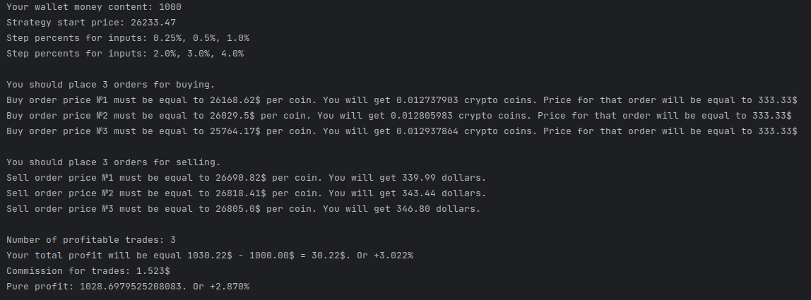
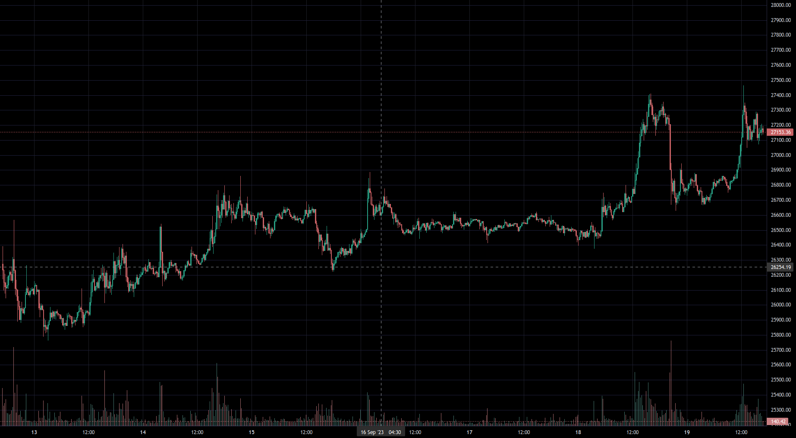

# Trading Simulation Software

## Overview

This software provides a trading simulation platform for conducting trading strategy simulations on the Binance exchange. It allows users to implement and test their trading strategies using historical data in a CSV format. The simulation is based on the specified strategy and provides a trading view for analysis.

## Features
- Strategy Simulation: users can define and implement their trading strategies within the simulation environment.
- Binance Integration: integration with Binance enables realistic trading simulations using Binance historical data.
- Trading View: the software offers a trading view that allows users to analyze simulated trades and results.

## Requirements
- Python 3.11

## Setup
1. **Clone the repository or download the source code.**
2. **Install the required dependencies using pip:** ```pip install -r requirements.txt```
3. **Install separately *tvdatafeed*:** ```pip install --upgrade --no-cache-dir git+https://github.com/rongardF/tvdatafeed.git```

## Usage
Run the program by executing the main script: ```python3 main.py```

## Example

